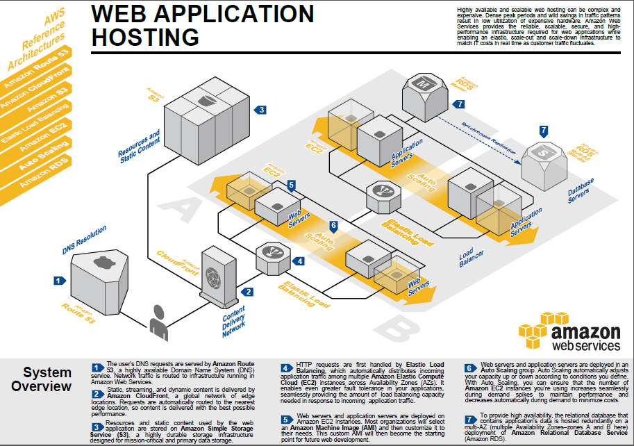

# Streamer Event Viewer

## Functionalities:
1. Login page which allows a user to login with Twitch and then make them able to set their favorite Twitch streamer name.
2. The next page manifests an embedded livestream, chat for the favorite streamer.

## Deployment of the above on AWS:

## Bottlenecks and Scaling:
The architecture is now able to hande small scale requests(for example, 100 reqs/day). In order to make the architecture be able to handle large amount of requests(for example, 900MM reqs/day), we need to migrate to RDS for Database. Moreover, we need to setup multiple EC2 instances under a load balancer.
